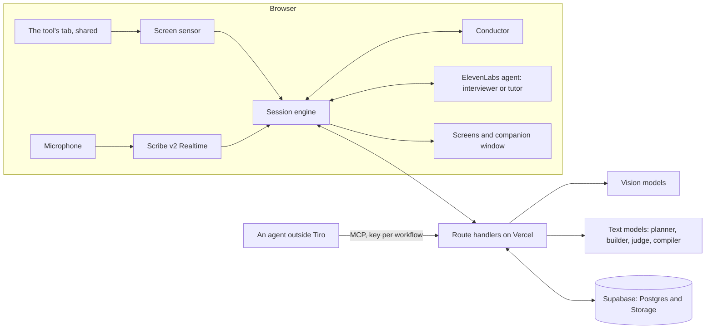

# Tiro: architecture

Tiro is an apprentice that watches an expert work in any web tool through screen share, asks why at the right moments, turns what it learned into a Work Map, and teaches it to a new hire on their own screen.

This page says what the parts are, what each one decides, and how a session flows through them.

## The parts

| Part | Where it runs | What it does |
|---|---|---|
| Screen sensor | Browser, in a worker | Reads the shared tab, compares frames, and sends a frame only when the screen has changed and settled |
| Frame reading | Server, vision model | Turns a frame into what the screen shows (screen, item, fields) and what changed since the last one (events) |
| Scribe v2 Realtime | Browser | Transcribes the person. The agent's own microphone stays muted, so Tiro never transcribes itself |
| Conductor | Browser, plain code | Decides when Tiro may speak. No model is involved in timing |
| Question planner | Server, text model | Proposes the summary and the follow-up questions for a screen; code filters and ranks them |
| Interviewer and tutor | ElevenLabs Agents | Two agent configurations. They speak only when the app gives them a turn |
| Work Map builder and validator | Server | A model proposes steps and rules; code decides what stands |
| Rule engine, judge and compiler | Server | Check what the new hire says or does against the confirmed rules |
| MCP server | Server, one route | Read-only access to confirmed Work Maps for an agent outside Tiro |
| Database | Supabase | Sessions, frames, events, utterances, questions, Work Maps, rules, tool map, baseline |

## Who decides what

The models propose; code decides. This is the rule the design holds to throughout.

| Decision | Made by | How |
|---|---|---|
| When Tiro speaks | Code (Conductor) | The screen has been still, nobody is speaking, the moment is fresh, and the gap since Tiro's last turn has passed |
| What Tiro asks | Model proposes, code filters | A question the screen, the transcript or the baseline already answers is dropped. Each guardrail kind (limit, exception, stop and ask) stays prioritised until it has been asked |
| What goes into the Work Map | Model proposes, code validates | A step needs a verified screen event and the expert's reason. A rule needs the expert's own words. Whatever fails comes back as a debrief question |
| Whether the map is done | Code, then the expert | The validator must find nothing missing; then Tiro explains the process back and the expert confirms by voice |
| Whether the new hire broke a rule | Code where it can, a model otherwise | A rule that can be written as a condition over the tool's fields is checked by a generic engine. The rest are judged by a model against the rule and the expert's words |

## One expert session

1. The expert shares the tool's tab. The sensor sends a frame when the screen changes and settles.
2. The server reads the frame and stores the events. Events arrive in the agent as silent context: it knows what happened but does not reply.
3. When the expert has paused, the Conductor opens the floor. Tiro says what it understood in one sentence, then asks one follow-up.
4. The answer is transcribed in the browser and stored with the question it answers.
5. When the task ends, decisions are read a second time by a stronger vision model. What it doubts becomes a question.
6. In the debrief Tiro asks the open questions, builds the map, asks for any guardrail kind still missing, and explains the process back. The expert corrects or confirms by voice.

## One tutor session

1. The new hire starts a lesson on the confirmed Work Map, in their own language if they choose one.
2. When they open an item, Tiro says what the expert does with such an item and asks what they would decide.
3. Their answer is checked against every rule before they act. A broken rule is caught, explained in the expert's words, and the expert's screen at that moment is shown.
4. At the end a mastery report shows each rule's outcome and what to practise next.

## What keeps it general

Nothing in the code or in a fixed prompt names a tool or a workflow. The tool, the task, the baseline, the questions, the steps and the rules are data. The prompts are templates. A test fails the build if the first demo workflow's words appear in an agent's prompt.

## Where the secrets are

All keys stay on the server. The browser gets a signed address for the agent and a single-use transcription token. The database has row-level security on with no client policies, so every read and write goes through a route handler that checks who is signed in and what they are on the workflow.

## What is not built

| Not built | What exists in its place |
|---|---|
| Off the record | The agents have the tool and say plainly that it is not available yet |
| Blurring personal data in frames, scrubbing transcripts | A field can be marked as personal data; the mark is stored and respected in the export |
| The grading report against a private answer key | The tables exist; nothing reads them yet |
| The expert teaching in another language | Only the tutor's side: a lesson can be held in another language |
| Two experts compared | Not started |
| The tutor's live lookup over MCP | Built; it waits on MCP servers being switched on in the ElevenLabs workspace |
